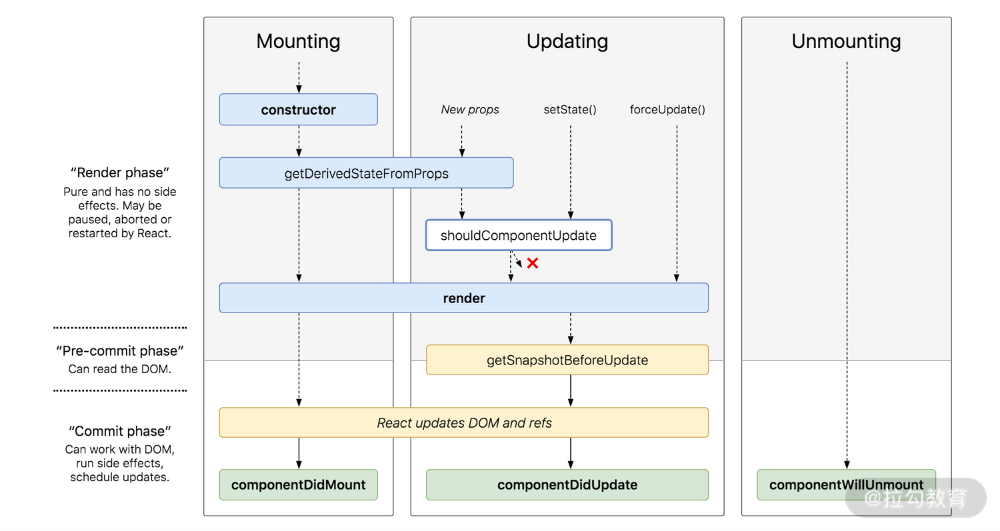

### 虚拟 DOM：核心算法的基石

组件在初始化时，会通过调用生命周期中的render()，生成虚拟DOM，然后再通过调用ReactDOM.render()，实现虚拟DOM到真实DOM的转换。

当组件更新时，会再次通过调用render()生成新的虚拟DOM，然后借助diff算法定位出两次虚拟DOM的差异，从而针对发生变化的真实DOM作定向更新。

#### React15生命周期

##### 注意  

* componentWillMount和componentWillUpdate会在执行render前被触发，允许你在里面做一些不涉及真实DOM操作的准备工作。  
* componentReceiveProps并不是由父组件传递给子组件的props变化触发的，而是由父组件的更新触发的。例如修改父组件的state，state并没有作为props传递给子组件，子组件componentReceiveProps还是会调用。  
* 可以将componentDidUpdate的执行作为子组件更新完毕的标志通知到父组件。  

##### 组件销毁的原因  

1. 组件在父组件中被移除了，例如组件在一定条件下才显示，如果条件不成立时，组件就销毁。  
2. 组件中设置了key属性，父组件在render的过程中，发现key值和上一次不一致，那么这个组件就会被干掉。

#### React16.3生命周期

##### getDerivedStateFromProps：使用props来派生/更新state

1. 是一个静态方法
2. 接收两个参数：props(父组件的props)和state(当前组件自身的state)
3. state的更新动作并非"覆盖"式的更新，而是针对某个属性的定向更新
4. 并不是由父组件传递给子组件的props变化触发的，而是由父组件的更新触发的。例如修改父组件的state，state并没有作为props传递给子组件，子组件getDerivedStateFromProps还是会调用。  

##### getSnapshotBeforeUpdate

1. getSnapshotBeforeUpdate的返回值会作为第三个参数给到componentDidUpdate
2. 执行时机是在render之后，真实DOM更新之前。可以获取到更新前的真实DOM和更新前后的state&props

#### React16.4生命周期

16.4中，任何因素触发的组件更新流程(包括由this.setState和forceUpdate触发的更新流程都会触发 getDerivedStateFromProps。

16.3版本时，只有父组件的更新才会触发getDerivedStateFromProps。

#### Fiber架构简析

描述：React16之前，新的虚拟DOM树和上一次的虚拟DOM树进行diff，实现对DOM的定向更新。这是一个递归过程。同步渲染的递归调用栈是非常深的，只有最底层的调用返回了。整个渲染过程才会开始逐层返回。同步渲染一旦开始，就不能打断，并且会牢牢抓住主线程不放，直到递归彻底完成。在这个过程中，浏览器没有办法处理任何渲染之外的事情，会进入一种无法处理用户交互。

React16的Fiber架构，Fiber会将一个大的更新任务拆解为许多个小任务。每当执行完一个小任务时，渲染线程都会把主线程交回去，看看有没有优先级更高的工作要处理，确保不会出现其他任务被"饿死"的情况，进而避免同步渲染带来的卡顿。在这个过程中，渲染线程不再"一去不回头"，而是可以被打断的，这就是所谓的"异步渲染"。  

根据"能否被打断"这一标准，React 16的生命周期被划分为了render和commit两个阶段，而commit阶段又被细分为了pre-commit和commit。  
* render阶段：纯净且没有副作用，可能会被 React 暂停、终止或重新启动(重复执行一遍整个任务)。  
* pre-commit阶段：可以读取DOM。  
* commit阶段：可以使用DOM，运行副作用，安排更新。  

特点：任务拆解和可打断