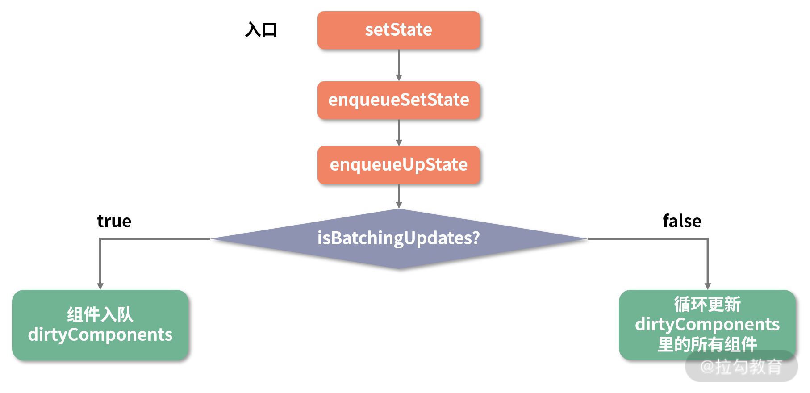

### 虚拟DOM

#### 虚拟DOM是什么

1. 虚拟DOM是JS对象
2.  虚拟DOM是对真实DOM的描述

#### 虚拟DOM大致是如何工作的

* 挂载阶段，React将结合JSX的描述，构建出虚拟DOM树，然后通过ReactDOM.render实现虚拟DOM到真实DOM的映射(触发渲染流水线)。
* 更新阶段，页面的变化在作用于真实DOM之前，会先作用于虚拟DOM，虚拟DOM将在J 层借助算法先对比出具体有哪些真实DOM需要被改变，然后再将这些改变作用于真实DOM。

#### 虚拟DOM解决的关键问题

1. 研发体验/研发效率的问题：虚拟DOM的出现，为数据驱动视图这一思想提供了高度可用的载体，使得前端开发能够基于函数式UI的编程方式实现高效的声明式编程。
2. 跨平台的问题：虚拟DOM是对真实渲染内容的一层抽象。若没有这一层抽象，那么视图层将和渲染平台紧密耦合在一起，为了描述同样的视图内容，同一套虚拟DOM，可以对接不同平台的渲染逻辑，从而实现"一次编码，多端运行"。

#### 批量更新

批量更新在通用虚拟DOM库里是由batch函数来处理的。batch的作用是缓冲每次生成的补丁集，它会把收集到的多个补丁集暂存到队列中，再将最终的结果交给渲染函数，最终实现集中化的DOM批量更新。

### 协调(调和)

#### 描述

通过如ReactDOM等类库使虚拟DOM与"真实的"DOM同步，这一过程叫作协调(调和)。也就是说调和指的是将虚拟DOM映射到真实DOM的过程。

Diff确实是调和过程中最具代表性的一环。根据Diff实现形式的不同，调和过程被划分为了以React 15为代表的"栈调和"以及React 16以来的"Fiber 调和"。"栈调和"指的就是React 15的Diff算法。

#### Diff算法设计思想

1. 只针对相同层级的节点作对比
2. 只有同类型的组件，才有进一步对比的必要性
3. key属性的设置，可以帮我们尽可能重用同一层级内的节点

### setState

#### 描述

setState并不是单纯同步/异步的，它的表现会因调用场景的不同而不同：在React钩子函数及合成事件中，它表现为异步；而在setTimeout、setInterval等函数中，包括在DOM原生事件中，它都表现为同步。这种差异，本质上是由React事务机制和批量更新机制的工作方式来决定的。

#### 批量更新

每来一个setState，就把它塞进一个队列里"攒起来"。等时机成熟，再把"攒起来"的state结果做合并，最后只针对最新的state值走一次更新流程。

```react
export default class StateOperation extends React.Component {
  
  state = {
    count: 0
  }
  
  increment = () => {
    console.log('increment setState前的count', this.state.count)
    this.setState({count: this.state.count + 1});
    console.log('increment setState后的count', this.state.count)
  }
  
  triple = () => {
    console.log('triple setState前的count', this.state.count)
    this.setState({count: this.state.count + 1});
    this.setState({count: this.state.count + 1});
    this.setState({count: this.state.count + 1});
    console.log('triple setState后的count', this.state.count)
  }
  
  reduce = () => {
    setTimeout(() => {
      console.log('reduce setState前的count', this.state.count)
      this.setState({count: this.state.count - 1});
      console.log('reduce setState后的count', this.state.count)
    }, 0);
  }
  
  render() {
    return <div>
      <button onClick={this.increment}>点我增加</button>
      <button onClick={this.triple}>点我增加三倍</button>
      <button onClick={this.reduce}>点我减少</button>
    </div>
  }
}

//从左到右点击，结果
increment setState前的count 0
increment setState后的count 0
triple setState前的count 1
triple setState后的count 1
reduce setState前的count 2
reduce setState后的count 1
```

#### setState工作流



### Fiber架构

JavaScript是单线程的，浏览器是多线程的。多线程的浏览器来说，它除了要处理JavaScript线程以外，还需要处理包括渲染线程、事件系统、定时器/延时器、网络请求等各种各样的任务线程。当其中一个线程执行时，另一个线程只能挂起等待。如果JavaScript线程长时间地占用了主线程，那么渲染层面的更新就不得不长时间地等待，界面长时间不更新，带给用户的体验就是所谓的"卡顿"。

#### 栈调和的不足

栈调和机制下的Diff算法是一个同步的递归过程，不可以被打断。当处理结构相对复杂、体量相对庞大的虚拟 DOM树时，栈调和需要的调和时间会很长，这就意味着JavaScript线程将长时间地霸占主线程，进而导致渲染卡顿/卡死、交互长时间无响应等问题。

#### Fiber架构的优化

我们有进程、线程之分，而Fiber就是比线程还要纤细的一个过程，也就是所谓的"纤程"。

Fiber是React内部所定义的一种数据结构，它是Fiber树结构的节点单位，也就是React 16新架构下的"虚拟 DOM"。

Fiber架构的应用目的，按照React官方的说法，是实现"增量渲染"。所谓"增量渲染"，通俗来说就是把一个渲染任务分解为多个渲染任务，而后将其分散到多个帧里面。不过严格来说，增量渲染其实也只是一种手段，实现增量渲染的目的，是为了实现任务的可中断、可恢复，并给不同的任务赋予不同的优先级，最终达成更加顺滑的用户体验。

每个更新任务都会被赋予一个优先级。当更新任务抵达调度器时，高优先级的更新任务(记为 A)会更快地被调度进调和层；此时若有新的更新任务(记为 B)抵达调度器，调度器会检查它的优先级，若发现 B 的优先级高于当前任务 A，那么当前处于调和层的 A 任务就会被中断，调度器会将 B 任务推入调和层。当 B 任务完成渲染后，新一轮的调度开始，之前被中断的 A 任务将会被重新推入调和层，继续它的渲染之旅，这便是所谓"可恢复"。